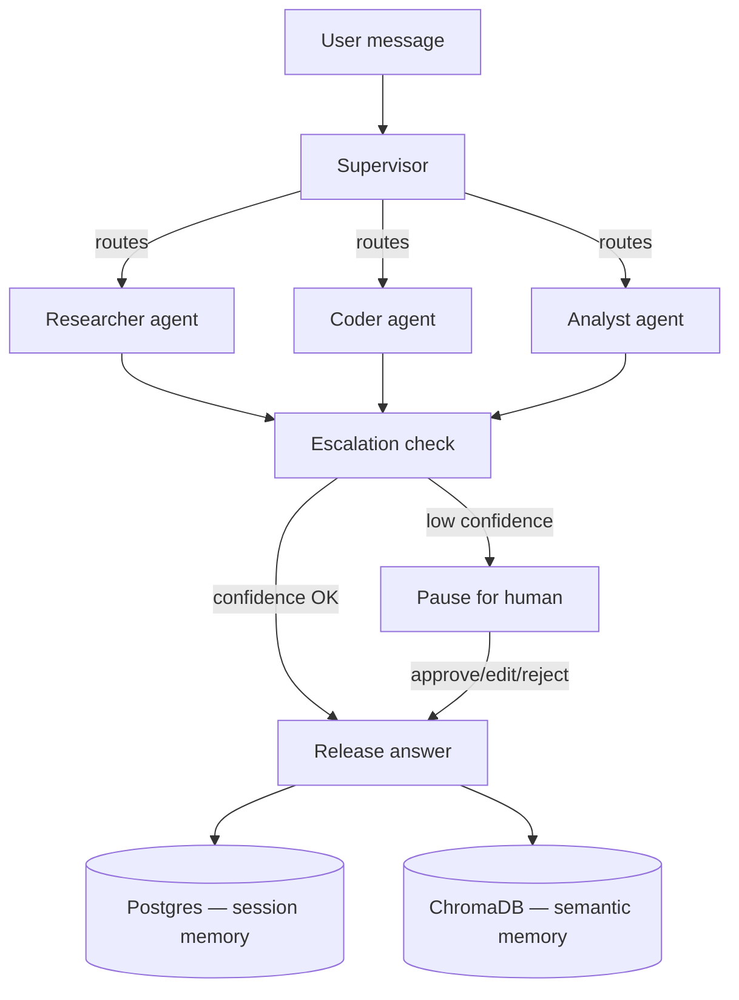

# 🧠 Agent Orchestration System

A multi-agent system with supervisor-based task delegation, persistent memory, and human-in-the-loop escalation — built entirely on free, open-source, self-hosted infrastructure. No paid API keys required.

[]()
[]()
[](LICENSE)

## Demo


## Why this project

Most agent demos are single-agent, stateless, and fully autonomous with no safety net. This project adds three things most portfolio agent projects skip:

- **Supervisor delegation** — a routing agent decides which specialist (researcher, coder, analyst) handles each request, instead of one flat prompt trying to do everything
- **Persistent memory** — session history in PostgreSQL and semantic recall in ChromaDB, so context survives restarts
- **Human-in-the-loop escalation** — every specialist scores its own confidence; low-confidence or high-risk answers pause for human approval instead of being released automatically

## Architecture



## Stack (all free)

| Layer | Tool |
|---|---|
| Orchestration | [LangGraph](https://github.com/langchain-ai/langgraph) |
| LLM | [Ollama](https://ollama.com) running Llama 3.2, fully local |
| Memory | PostgreSQL (session/turn history) + ChromaDB (semantic recall) |
| Queue | Redis + Celery (async agent execution) |
| API | FastAPI |
| Frontend | Streamlit |

## Setup

### 1. Start infrastructure
```bash
docker compose up -d
docker exec -it aos_ollama ollama pull llama3.2
```

### 2. Python environment
```bash
python -m venv venv
source venv/bin/activate      # Windows: venv\Scripts\activate
pip install -r requirements.txt
cp .env.example .env
```

### 3. Run the API
```bash
uvicorn app.main:app --reload --port 8000
```

### 4. Run the Celery worker (new terminal)
```bash
celery -A app.queue.celery_app worker --loglevel=info
```
> On Windows, add `--pool=solo` — Celery's default prefork pool isn't supported on Windows.

### 5. Run the frontend (new terminal)
```bash
streamlit run frontend/streamlit_app.py
```

Open the URL Streamlit prints, send a message, and watch the **Pending Approvals** panel when a specialist's confidence drops below the threshold set in `.env` (`CONFIDENCE_THRESHOLD`, default `0.55`).

## How escalation works

Each specialist agent ends its response with a confidence score. If that score falls below `CONFIDENCE_THRESHOLD` — or the request/response contains a risky action keyword (delete, drop table, sudo, etc.) — the graph routes to a `pause_for_human` node instead of releasing the answer immediately. The Streamlit "Pending Approvals" panel lets a reviewer approve, edit, or reject the answer before it's finalized — this is what makes the system human-in-the-loop rather than fully autonomous.

## File structure

```
agent-orchestration-system/
├── docker-compose.yml
├── requirements.txt
├── .env.example
├── README.md
├── app/
│   ├── main.py                   # FastAPI entrypoint
│   ├── config.py
│   ├── orchestration/
│   │   ├── graph.py               # LangGraph state graph
│   │   ├── supervisor.py          # routing/delegation logic
│   │   ├── state.py               # shared agent state schema
│   │   └── agents/
│   │       ├── researcher.py
│   │       ├── coder.py
│   │       ├── analyst.py
│   │       └── base_agent.py
│   ├── memory/
│   │   ├── postgres_store.py      # structured/session memory
│   │   └── vector_store.py        # ChromaDB semantic memory
│   ├── queue/
│   │   ├── celery_app.py
│   │   └── tasks.py               # async agent jobs
│   └── escalation/
│       └── escalation_manager.py  # confidence-threshold + keyword escalation logic
└── frontend/
    └── streamlit_app.py           # chat UI + human-approval panel
```

## Extending it

- **Add a new specialist:** drop a new file in `app/orchestration/agents/`, register it in `graph.py`, and add it to the supervisor's routing prompt in `supervisor.py`.
- **Swap the LLM:** change `OLLAMA_MODEL` in `.env` to any other model pulled into Ollama (e.g. `mistral`, `llama3.1`).
- **Add real tools:** drop tool implementations (web search, file access) in `app/tools/` and call them from inside a specialist agent before it responds.

## License

MIT — see [LICENSE](LICENSE).
