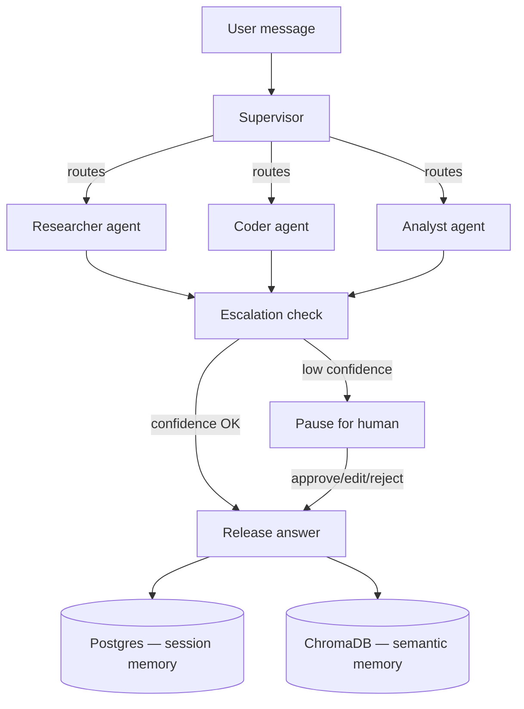

# Agent Orchestration System

A multi-agent system with supervisor-style delegation, persistent memory, and
human-in-the-loop escalation — built entirely on free, open-source, self-hosted
components. No paid API keys required.

## Architecture



## Stack (all free)

- **Orchestration:** LangGraph
- **LLM:** Ollama running Llama 3.2 locally
- **Memory:** PostgreSQL (session/turn history) + ChromaDB (semantic recall)
- **Queue:** Redis + Celery (async agent execution)
- **API:** FastAPI
- **Frontend:** Streamlit

## Setup

1. **Start infrastructure**
   ```bash
   docker compose up -d
   docker exec -it aos_ollama ollama pull llama3.2
   ```

2. **Python environment**
   ```bash
   python -m venv venv
   source venv/bin/activate      # Windows: venv\Scripts\activate
   pip install -r requirements.txt
   cp .env.example .env
   ```

3. **Run the API** (in one terminal)
   ```bash
   uvicorn app.main:app --reload --port 8000
   ```

4. **Run the Celery worker** (in a second terminal)
   ```bash
   celery -A app.queue.celery_app worker --loglevel=info
   ```

5. **Run the frontend** (in a third terminal)
   ```bash
   streamlit run frontend/streamlit_app.py
   ```

6. Open the Streamlit URL it prints, chat with the system, and watch the
   **Pending Approvals** panel when a specialist agent's confidence drops
   below the threshold in `.env` (`CONFIDENCE_THRESHOLD`, default 0.55).

## How escalation works

Each specialist agent is prompted to end its response with a confidence
score. If that score falls below `CONFIDENCE_THRESHOLD`, the graph routes to
a `pause_for_human` node instead of releasing the answer. The Streamlit
"Pending Approvals" panel lets a reviewer approve, edit, or reject the
answer before it's finalized — this is what makes it human-in-the-loop
rather than fully autonomous.

## Extending it

- Add a new specialist: drop a new file in `app/orchestration/agents/`,
  register it in `graph.py`, and add it to the supervisor's routing prompt.
- Swap Llama 3.2 for any other Ollama model by changing `OLLAMA_MODEL` in `.env`.
- Add real tools (web search, file access) in `app/tools/` and call them
  from inside a specialist agent before it responds.
